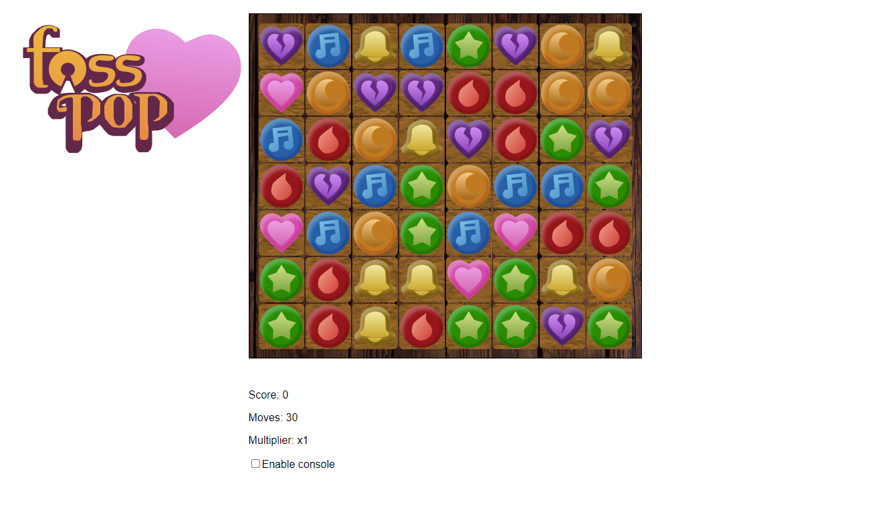
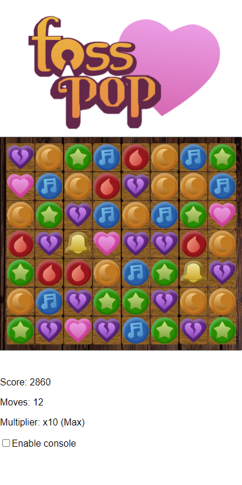

[](https://drone.matt-barnes.co.uk/mb2g17/fosspop)
[](https://github.com/mb2g17/fosspop)
[](https://www.gnu.org/licenses/agpl-3.0)

## Table of contents

-   [About](#about)
-   [Demo](#demo)
-   [Setup (Manual)](#setup-manual)
-   [Setup (Docker)](#setup-docker)
-   [Images](#images)

# About

This project is a watered-down, free-and-open-source (FOSS) clone of the game HuniePop, created to test the waters of Emscripten and WebAssembly.

This clone takes out all the dating aspects of HuniePop, leaving just the puzzle gameplay.

# Demo

[A demo of the game can be played on the GitHub Pages site.](https://demos.matt-barnes.co.uk/fosspop/)

# Setup (Manual)

The prerequisites for this project are:

-   A C++ compiler (obviously)
-   CMake
-   Emscripten SDK
-   SDL2
-   SDL2_image
-   SDL2_mixer

## Project

First, pull the repository, enter it, and create a folder to compile the project in.

```shell
> mkdir cmake_build
> cd cmake_build
```

To compile the project, run CMake on the 'src' folder and provide the Emscripten toolchain file path. Your path may differ, but generally, it's `emsdk/upstream/emscripten/cmake/Modules/Platform/Emscripten.cmake`.

```shell
> mkdir cmake_build
> cd cmake_build
> cmake ../src -DCMAKE_TOOLCHAIN_FILE=<Emscripten toolchain file path>
```

Now, simply `make` the project and point a HTTP server to the 'dist' folder.

```shell
> make all
> http-server dist
```

## Unit Tests

First, pull the repository, enter it, and create a folder to compile the unit tests in.

```shell
> mkdir cmake_tests
> cd cmake_tests
```

To compile the unit tests, run CMake on the root of the project. No Emscripten toolchain files are required.

```shell
> cmake ..
```

Now, simply `make` the unit tests and run the executable.

```shell
> make all
> ./tests/FossPop_Tests
```

# Setup (Docker)

## Unit Tests

```shell
> docker build -t fosspop-tests -f Dockerfile.tests .
> docker run fosspop-tests
```

# Images

Desktop



Mobile


